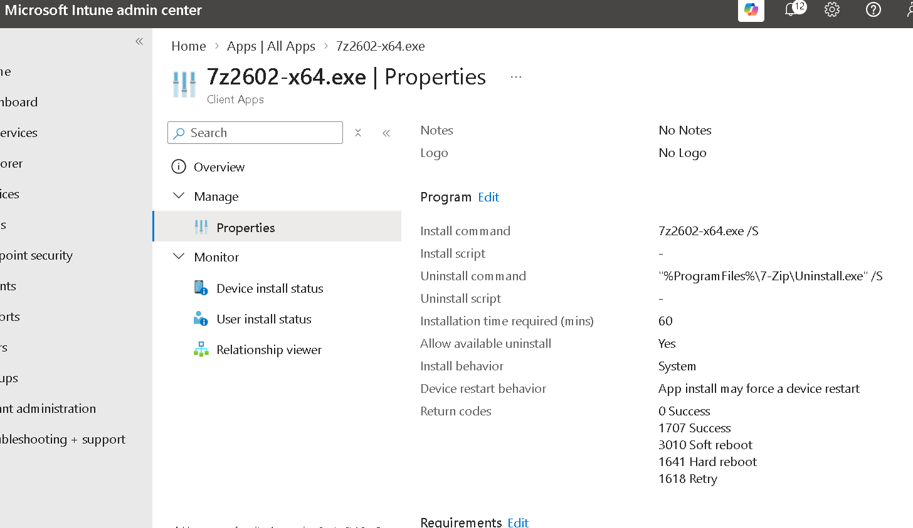

# Win32 Application Management

# Overview

In this project I packaged 7-Zip as a Win32 application and configured it in Microsoft Intune.

I used the Microsoft Win32 Content Prep Tool to convert the 7-Zip installer into an `.intunewin` package and then configured the application in Intune with silent install and uninstall commands, requirements and a detection rule.

## What I Did

- Downloaded the 64-bit 7-Zip installer
- Used the Microsoft Win32 Content Prep Tool to package the installer
- Created an `.intunewin` package
- Added the packaged application to Microsoft Intune
- Configured silent install and uninstall commands
- Configured the app to install in the System context
- Configured requirements for the application
- Created a file-based detection rule for 7-Zip
- Reviewed the completed Win32 application configuration in Intune

## Program Configuration

I configured the application to install silently without requiring user interaction.

The install command used was:

`7z2602-x64.exe /S`

The application was also configured to install using the System context.

## Detection Rule

I created a file-based detection rule so that Intune can determine whether 7-Zip is present on the device.

The rule checks for:
`C:\Program Files\7-Zip\7z.exe`

## Win32 Application

After completing the configuration, the 7-Zip package was added to Microsoft Intune as a Windows Win32 application.

